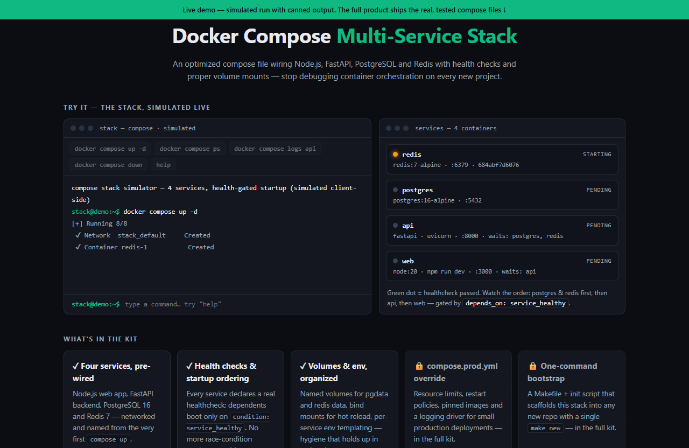

# Docker Compose Multi-Service Stack — live demo

  

  <a href="https://amos-mig.github.io/dockerfile-compose-vault-demo/"><strong>▶ Open the live demo</strong></a> ·
  <a href="https://amosmign.gumroad.com/l/dockerfile-compose-vault"><strong>Get the full product · €14</strong></a>

## What this is

An in-browser simulator of the Docker Compose Multi-Service Stack: a working terminal where you run compose up / ps / logs / down and watch all four services (Node.js, FastAPI, PostgreSQL, Redis) come up green in health-gated dependency order, mirrored by a live service panel. Locked cards tease the prod override and one-command bootstrap that ship only in the paid kit.

**Try it:** Click 'docker compose up -d' and watch postgres and redis pass their healthchecks before api and web are allowed to start, then run 'docker compose logs api' to see the FastAPI service.

## What you get in the full product

- Four services pre-wired: Node.js, FastAPI, PostgreSQL, Redis
- Health checks on every service with proper startup ordering
- Volume mounts and environment variables organized for real projects
- Optimized for local dev and small production deployments
- Works with plain docker compose — no extra tooling

## About

- **Storefront:** [kits.amosmignery.dev](https://kits.amosmignery.dev) — single-file products, instant download, commercial license
- **Checkout:** [Gumroad](https://amosmign.gumroad.com/l/dockerfile-compose-vault) (Merchant of Record, VAT handled)
- **Full product:** [Docker Compose Multi-Service Stack](https://amosmign.gumroad.com/l/dockerfile-compose-vault) · €14

## License

The demo page in this repo is MIT-licensed — reuse the technique, not the product.
The **Docker Compose Multi-Service Stack** itself is not included here and is not free software.
